# RedSorcery

A Minecraft Spigot plugin that adds rituals to interact with the world aswell as players and their tools.

# Permissions
## Commands
## Rituals
These permissions allow the use of rituals
|Ritual|Node|Description|
|----|:----:|------|
| Modify Weather | redsorcery.rituals.modweather | |
| Kill Server | redsorcery.rituals.killserver | |
| Kill Server Head | redsorcery.rituals.killserver.head | This permission needs to be given to any player/group that when their head is sacrified to the kill server ritual it is allowed to function |
| Ritual of Enchantment | redsorcery.rituals.enchant | |

# Rituals
All Rituals are activated by growing a sapling on the moss block.\
All rituals must be built with the top being north

X = Moss Block\
Y = Sapling\
' ' = Any Block (indicated by white concrete in pictures)

## Modify Weather
A ritual that stops the rain or a storm in the current world.
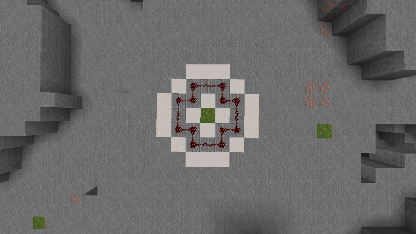

If a water bucket is dropped into the area, it will start the rain instead of stopping.

Text Based Instructions

<pre>
A = AIR Blocks
C = Stone Brick Blocks
R = Redstone Wire 

From north to south
First Layer
{ ' ', 'C', 'C', 'C', ' ' }
{ 'C', 'C', ' ', 'C', 'C' }
{ 'C', ' ', 'X', ' ', 'C' }
{ 'C', 'C', ' ', 'C', 'C' }
{ ' ', 'C', 'C', 'C', ' ' }
Second Layer (1 block above last)
{ ' ', 'R', 'R', 'R', ' ' }
{ 'R', 'R', 'A', 'R', 'R' }
{ 'R', 'A', 'Y', 'A', 'R' }
{ 'R', 'R', 'A', 'R', 'R' }
{ ' ', 'R', 'R', 'R', ' ' }
</pre>

## Ritual of Enchantment
A ritual that allows enchanting multiple items at once using books without consuming the books.
The beacon needs to have an active effect.
Consumes the amethyst clusters every operation.

Building Images

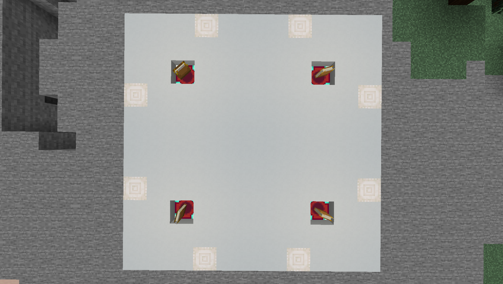
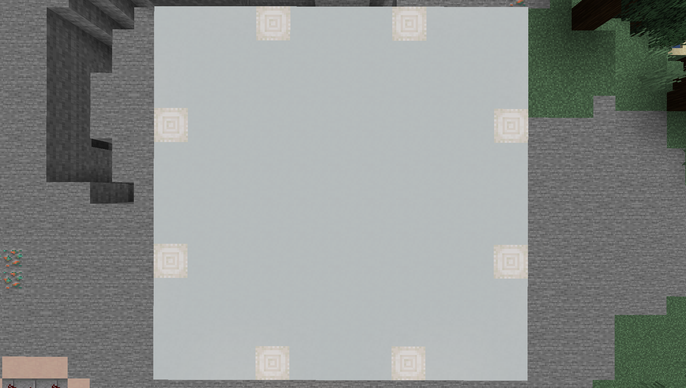

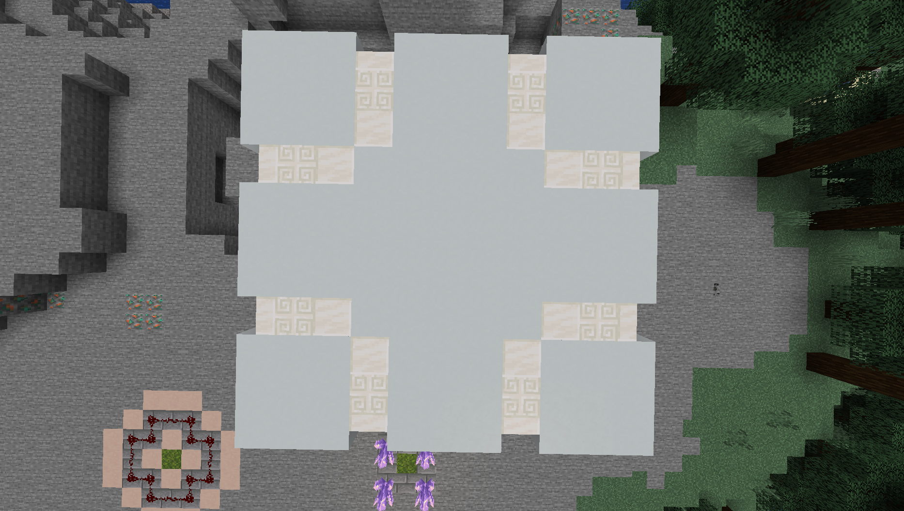
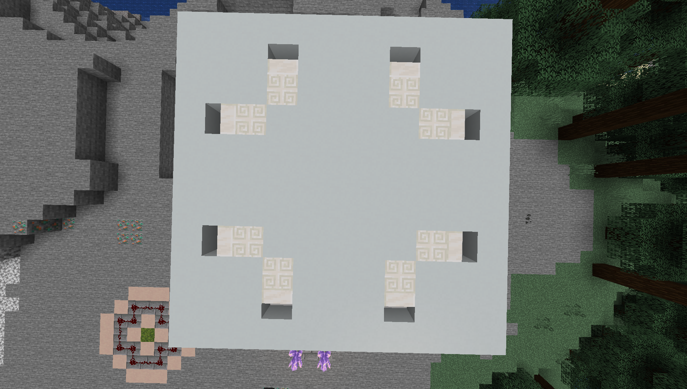
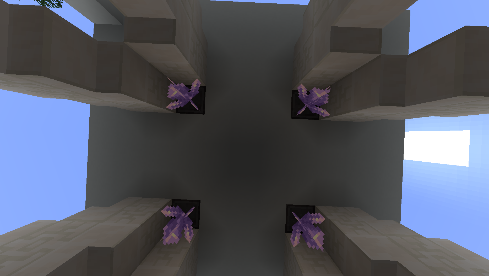
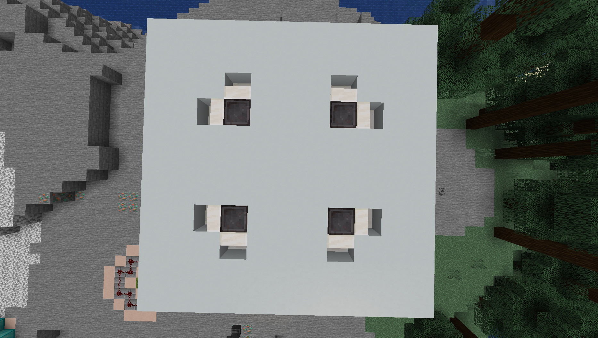
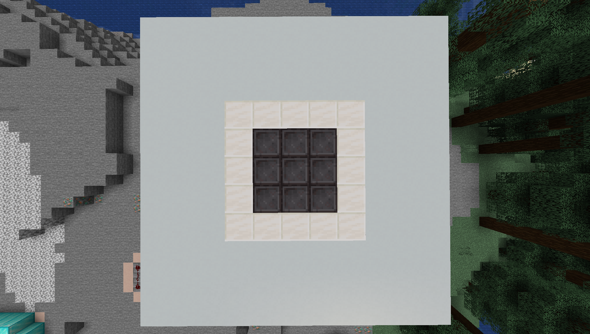
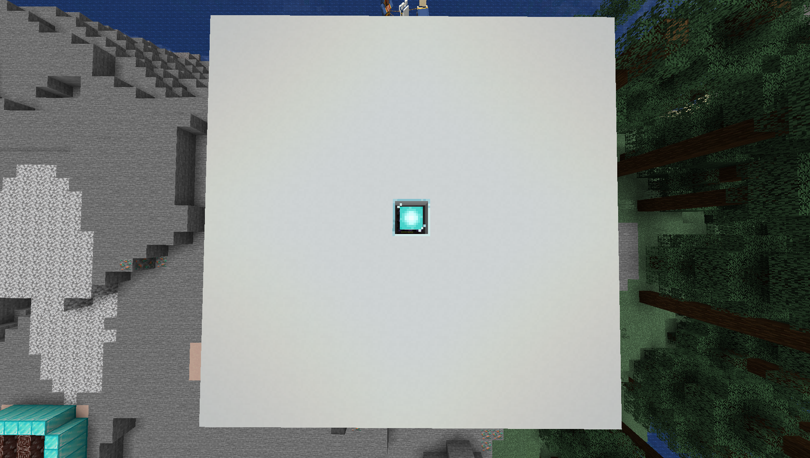

Text Based Instructions

<pre>
'S' = STONE_BRICKS
'P' = QUARTZ_PILLAR
'T' = ENCHANTING_TABLE
'D' = DEEPSLATE_TILES
'A' = POLISHED_BLACKSTONE_BRICK_STAIRS
'Q' = QUARTZ_STAIRS
'B' = BEACON
'C' = AMETHYST_CLUSTER
'E' = CHISELED_QUARTZ_BLOCK
'N' = NETHERITE_BLOCK
 

From north to south
First Layer
{ ' ', ' ', ' ', 'S', 'S', 'S', 'S', 'S', ' ', ' ', ' ' }
{ ' ', ' ', 'S', ' ', ' ', ' ', ' ', ' ', 'S', ' ', ' ' }
{ ' ', 'S', ' ', ' ', ' ', ' ', ' ', ' ', ' ', 'S', ' ' }
{ 'S', ' ', ' ', 'D', 'D', 'D', 'D', 'D', ' ', ' ', 'S' }
{ 'S', ' ', ' ', 'D', 'A', 'A', 'A', 'D', ' ', ' ', 'S' }
{ 'S', ' ', ' ', 'D', 'A', 'X', 'A', 'D', ' ', ' ', 'S' }
{ 'S', ' ', ' ', 'D', 'A', 'A', 'A', 'D', ' ', ' ', 'S' }
{ 'S', ' ', ' ', 'D', 'D', 'D', 'D', 'D', ' ', ' ', 'S' }
{ ' ', 'S', ' ', ' ', ' ', ' ', ' ', ' ', ' ', 'S', ' ' }
{ ' ', ' ', 'S', ' ', ' ', ' ', ' ', ' ', 'S', ' ', ' ' }
{ ' ', ' ', ' ', 'S', 'S', 'S', 'S', 'S', ' ', ' ', ' ' }
Second Layer
{ ' ', ' ', ' ', 'P', ' ', ' ', ' ', 'P', ' ', ' ', ' ' }
{ ' ', ' ', ' ', ' ', ' ', ' ', ' ', ' ', ' ', ' ', ' ' }
{ ' ', ' ', 'T', ' ', ' ', ' ', ' ', ' ', 'T', ' ', ' ' }
{ 'P', ' ', ' ', ' ', ' ', ' ', ' ', ' ', ' ', ' ', 'P' }
{ ' ', ' ', ' ', ' ', ' ', ' ', ' ', ' ', ' ', ' ', ' ' }
{ ' ', ' ', ' ', ' ', ' ', 'Y', ' ', ' ', ' ', ' ', ' ' }
{ ' ', ' ', ' ', ' ', ' ', ' ', ' ', ' ', ' ', ' ', ' ' }
{ 'P', ' ', ' ', ' ', ' ', ' ', ' ', ' ', ' ', ' ', 'P' }
{ ' ', ' ', 'T', ' ', ' ', ' ', ' ', ' ', 'T', ' ', ' ' }
{ ' ', ' ', ' ', ' ', ' ', ' ', ' ', ' ', ' ', ' ', ' ' }
{ ' ', ' ', ' ', 'P', ' ', ' ', ' ', 'P', ' ', ' ', ' ' }
Third Layer
{ ' ', ' ', ' ', 'P', ' ', ' ', ' ', 'P', ' ', ' ', ' ' }
{ ' ', ' ', ' ', ' ', ' ', ' ', ' ', ' ', ' ', ' ', ' ' }
{ ' ', ' ', ' ', ' ', ' ', ' ', ' ', ' ', ' ', ' ', ' ' }
{ 'P', ' ', ' ', ' ', ' ', ' ', ' ', ' ', ' ', ' ', 'P' }
{ ' ', ' ', ' ', ' ', ' ', ' ', ' ', ' ', ' ', ' ', ' ' }
{ ' ', ' ', ' ', ' ', ' ', ' ', ' ', ' ', ' ', ' ', ' ' }
{ ' ', ' ', ' ', ' ', ' ', ' ', ' ', ' ', ' ', ' ', ' ' }
{ 'P', ' ', ' ', ' ', ' ', ' ', ' ', ' ', ' ', ' ', 'P' }
{ ' ', ' ', ' ', ' ', ' ', ' ', ' ', ' ', ' ', ' ', ' ' }
{ ' ', ' ', ' ', ' ', ' ', ' ', ' ', ' ', ' ', ' ', ' ' }
{ ' ', ' ', ' ', 'P', ' ', ' ', ' ', 'P', ' ', ' ', ' ' }
Fourth Layer
{ ' ', ' ', ' ', 'P', ' ', ' ', ' ', 'P', ' ', ' ', ' ' }
{ ' ', ' ', ' ', 'Q', ' ', ' ', ' ', 'Q', ' ', ' ', ' ' }
{ ' ', ' ', ' ', ' ', ' ', ' ', ' ', ' ', ' ', ' ', ' ' }
{ 'P', 'Q', ' ', ' ', ' ', ' ', ' ', ' ', ' ', 'Q', 'P' }
{ ' ', ' ', ' ', ' ', ' ', ' ', ' ', ' ', ' ', ' ', ' ' }
{ ' ', ' ', ' ', ' ', ' ', ' ', ' ', ' ', ' ', ' ', ' ' }
{ ' ', ' ', ' ', ' ', ' ', ' ', ' ', ' ', ' ', ' ', ' ' }
{ 'P', 'Q', ' ', ' ', ' ', ' ', ' ', ' ', ' ', 'Q', 'P' }
{ ' ', ' ', ' ', ' ', ' ', ' ', ' ', ' ', ' ', ' ', ' ' }
{ ' ', ' ', ' ', 'Q', ' ', ' ', ' ', 'Q', ' ', ' ', ' ' }
{ ' ', ' ', ' ', 'P', ' ', ' ', ' ', 'P', ' ', ' ', ' ' }
Fifth Layer
{ ' ', ' ', ' ', 'Q', ' ', ' ', ' ', 'Q', ' ', ' ', ' ' }
{ ' ', ' ', ' ', 'E', ' ', ' ', ' ', 'E', ' ', ' ', ' ' }
{ ' ', ' ', ' ', 'Q', ' ', ' ', ' ', 'Q', ' ', ' ', ' ' }
{ 'Q', 'E', 'Q', ' ', ' ', ' ', ' ', ' ', 'Q', 'E', 'Q' }
{ ' ', ' ', ' ', ' ', ' ', ' ', ' ', ' ', ' ', ' ', ' ' }
{ ' ', ' ', ' ', ' ', ' ', ' ', ' ', ' ', ' ', ' ', ' ' }
{ ' ', ' ', ' ', ' ', ' ', ' ', ' ', ' ', ' ', ' ', ' ' }
{ 'Q', 'E', 'Q', ' ', ' ', ' ', ' ', ' ', 'Q', 'E', 'Q' }
{ ' ', ' ', ' ', ' ', ' ', ' ', ' ', 'Q', ' ', ' ', ' ' }
{ ' ', ' ', ' ', 'E', ' ', ' ', ' ', 'E', ' ', ' ', ' ' }
{ ' ', ' ', ' ', 'Q', ' ', ' ', ' ', 'Q', ' ', ' ', ' ' }
Sixth Layer
{ ' ', ' ', ' ', ' ', ' ', ' ', ' ', ' ', ' ', ' ', ' ' }
{ ' ', ' ', ' ', 'Q', ' ', ' ', ' ', 'Q', ' ', ' ', ' ' }
{ ' ', ' ', ' ', 'E', ' ', ' ', ' ', 'E', ' ', ' ', ' ' }
{ ' ', 'Q', 'E', 'C', ' ', ' ', ' ', 'C', 'E', 'Q', ' ' }
{ ' ', ' ', ' ', ' ', ' ', ' ', ' ', ' ', ' ', ' ', ' ' }
{ ' ', ' ', ' ', ' ', ' ', ' ', ' ', ' ', ' ', ' ', ' ' }
{ ' ', ' ', ' ', ' ', ' ', ' ', ' ', ' ', ' ', ' ', ' ' }
{ ' ', 'Q', 'E', 'C', ' ', ' ', ' ', 'C', 'E', 'Q', ' ' }
{ ' ', ' ', ' ', 'E', ' ', ' ', ' ', 'E', ' ', ' ', ' ' }
{ ' ', ' ', ' ', 'Q', ' ', ' ', ' ', 'Q', ' ', ' ', ' ' }
{ ' ', ' ', ' ', ' ', ' ', ' ', ' ', ' ', ' ', ' ', ' ' }
Seventh Layer
{ ' ', ' ', ' ', ' ', ' ', ' ', ' ', ' ', ' ', ' ', ' ' }
{ ' ', ' ', ' ', ' ', ' ', ' ', ' ', ' ', ' ', ' ', ' ' }
{ ' ', ' ', ' ', 'Q', ' ', ' ', ' ', 'Q', ' ', ' ', ' ' }
{ ' ', ' ', 'Q', 'N', ' ', ' ', ' ', 'N', 'Q', ' ', ' ' }
{ ' ', ' ', ' ', ' ', ' ', ' ', ' ', ' ', ' ', ' ', ' ' }
{ ' ', ' ', ' ', ' ', ' ', ' ', ' ', ' ', ' ', ' ', ' ' }
{ ' ', ' ', ' ', ' ', ' ', ' ', ' ', ' ', ' ', ' ', ' ' }
{ ' ', ' ', 'Q', 'N', ' ', ' ', ' ', 'N', 'Q', ' ', ' ' }
{ ' ', ' ', ' ', 'Q', ' ', ' ', ' ', 'Q', ' ', ' ', ' ' }
{ ' ', ' ', ' ', ' ', ' ', ' ', ' ', ' ', ' ', ' ', ' ' }
{ ' ', ' ', ' ', ' ', ' ', ' ', ' ', ' ', ' ', ' ', ' ' }
Eigth Layer
{ ' ', ' ', ' ', ' ', ' ', ' ', ' ', ' ', ' ', ' ', ' ' }
{ ' ', ' ', ' ', ' ', ' ', ' ', ' ', ' ', ' ', ' ', ' ' }
{ ' ', ' ', ' ', ' ', ' ', ' ', ' ', ' ', ' ', ' ', ' ' }
{ ' ', ' ', ' ', 'Q', 'Q', 'Q', 'Q', 'Q', ' ', ' ', ' ' }
{ ' ', ' ', ' ', 'Q', 'N', 'N', 'N', 'Q', ' ', ' ', ' ' }
{ ' ', ' ', ' ', 'Q', 'N', 'N', 'N', 'Q', ' ', ' ', ' ' }
{ ' ', ' ', ' ', 'Q', 'N', 'N', 'N', 'Q', ' ', ' ', ' ' }
{ ' ', ' ', ' ', 'Q', 'Q', 'Q', 'Q', 'Q', ' ', ' ', ' ' }
{ ' ', ' ', ' ', ' ', ' ', ' ', ' ', ' ', ' ', ' ', ' ' }
{ ' ', ' ', ' ', ' ', ' ', ' ', ' ', ' ', ' ', ' ', ' ' }
{ ' ', ' ', ' ', ' ', ' ', ' ', ' ', ' ', ' ', ' ', ' ' }
Ninth Layer
{ ' ', ' ', ' ', ' ', ' ', ' ', ' ', ' ', ' ', ' ', ' ' }
{ ' ', ' ', ' ', ' ', ' ', ' ', ' ', ' ', ' ', ' ', ' ' }
{ ' ', ' ', ' ', ' ', ' ', ' ', ' ', ' ', ' ', ' ', ' ' }
{ ' ', ' ', ' ', ' ', ' ', ' ', ' ', ' ', ' ', ' ', ' ' }
{ ' ', ' ', ' ', ' ', ' ', ' ', ' ', ' ', ' ', ' ', ' ' }
{ ' ', ' ', ' ', ' ', ' ', 'B', ' ', ' ', ' ', ' ', ' ' }
{ ' ', ' ', ' ', ' ', ' ', ' ', ' ', ' ', ' ', ' ', ' ' }
{ ' ', ' ', ' ', ' ', ' ', ' ', ' ', ' ', ' ', ' ', ' ' }
{ ' ', ' ', ' ', ' ', ' ', ' ', ' ', ' ', ' ', ' ', ' ' }
{ ' ', ' ', ' ', ' ', ' ', ' ', ' ', ' ', ' ', ' ', ' ' }
{ ' ', ' ', ' ', ' ', ' ', ' ', ' ', ' ', ' ', ' ', ' ' }
</pre>

## Kill Server
This ritual will stop the server running, to activate it, the player head of a player with the correct permissions (listed above) is required to be thrown into the area.

Building Images

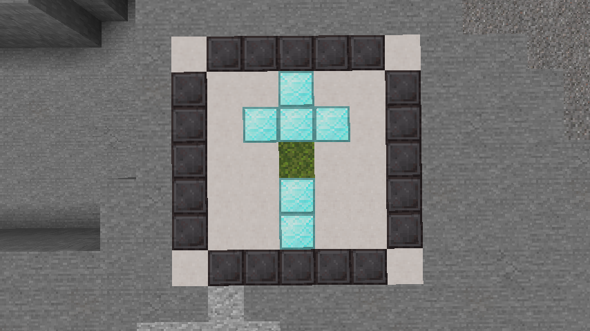
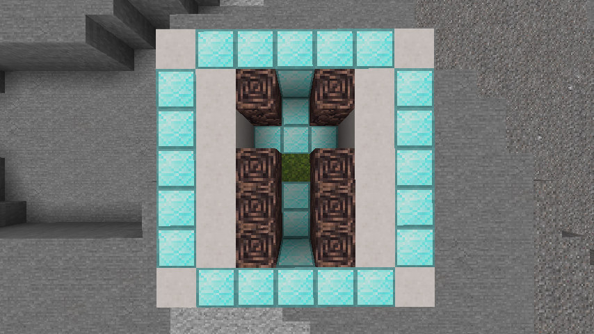

Text Based Instructions

<pre>
A = AIR Blocks
C = Netherite Blocks
B = Ancient Debris Blocks
R = Diamond Blocks 

From north to south
First Layer
{ ' ', 'C', 'C', 'C', 'C', 'C', ' ', }
{ 'C', ' ', ' ', 'R', ' ', ' ', 'C', }
{ 'C', ' ', 'R', 'R', 'R', ' ', 'C', }
{ 'C', ' ', ' ', 'X', ' ', ' ', 'C', }
{ 'C', ' ', ' ', 'R', ' ', ' ', 'C', }
{ 'C', ' ', ' ', 'R', ' ', ' ', 'C', }
{ ' ', 'C', 'C', 'C', 'C', 'C', ' ', }
Second Layer
{ ' ', 'R', 'R', 'R', 'R', 'R', ' ' }
{ 'R', ' ', 'B', 'A', 'B', ' ', 'R' }
{ 'R', ' ', 'A', 'A', 'A', ' ', 'R' }
{ 'R', ' ', 'B', 'Y', 'B', ' ', 'R' }
{ 'R', ' ', 'B', 'A', 'B', ' ', 'R' }
{ 'R', ' ', 'B', 'A', 'B', ' ', 'R' }
{ ' ', 'R', 'R', 'R', 'R', 'R', ' ' }
</pre>

